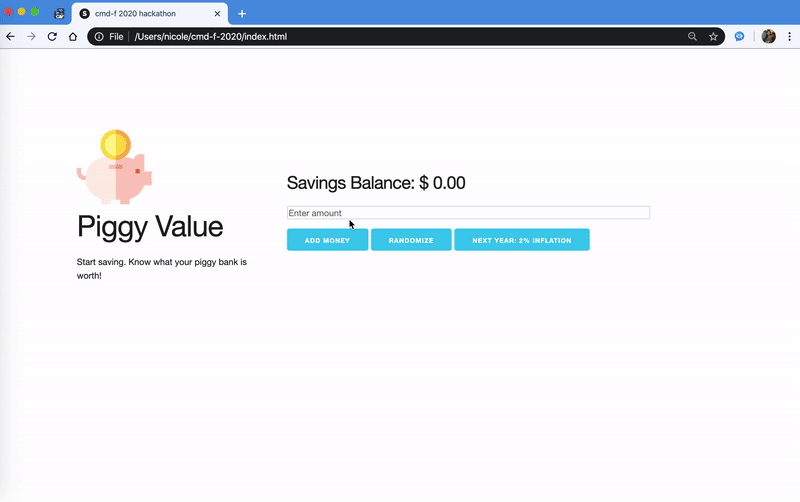

# cmd-f 2020

Built with Vanila javascript, HTML, CSS

## Piggy Value Demo:
Understand the value of a dollar and the concept of inflation visually.

  

## Inspiration

As online banking and app payments become popular, we carry and exchange cash less and less. Even the classic Monopoly game that has taught many about the concept of savings and spending has come out with an Electronic Banking version where the players simply hold on to credit cards. Nowadays, with buying something online being just a click of a button away, it is hard to distinguish between $1 and $1000 when they are just numbers on the screen. We lose a sense of what a dollar is truly worth.

The goal of this project is to build a tool to teach kids between ages 10-15 the concept of inflation and what a dollar value truly means through visual representation.

## What it does

When the user adds money to their savings account, a visual representation of their savings is displayed in terms of everyday items (e.g. coffee, movie tickets, a 3-credit UBC computer science course).

When the 2% Inflation button is pressed, the price of the every items will cost 2% more and the visual representations of the everyday item will adjust accordingly.

## How I built it

I first researched what money concepts are appropriate for different age groups. Then a mock up was done on paper with pen to figure out the layout. The project is built using vanilla JS, html and css.

## Challenges I ran into

The challenge I ran into was finding a financial concept to teach to ages between 10-15. Originally I wanted to focus on savings and spending, but upon some online research, I learned that parents explain the concept of savings to their children around the age of 5 and more appropriate concepts for my target audience should be on budgeting and compound interest. To compliment parents teaching their kids the idea of compound interest, I decided to focus my project on the concept of inflation.

## What's next for Piggy Value

Other concepts that I would love to incorporate into my project in the future is component interest and investment. These concepts will be a great segway from the inflation feature, and help us learn about making money choices.

## Sources:

Boilerplate and custom CSS provided by: http://getskeleton.com/
Coffee Icons made by <a href="https://www.flaticon.com/authors/freepik" title="Freepik">Freepik</a> from www.flaticon.com
Movie tickets Icons made by <a href="https://www.flaticon.com/authors/smashicons" title="Smashicons">Smashicons</a> from www.flaticon.com
Piggy Icons made by <a href="https://www.flaticon.com/authors/freepik" title="Freepik">Freepik</a> from www.flaticon.comcom</a>
